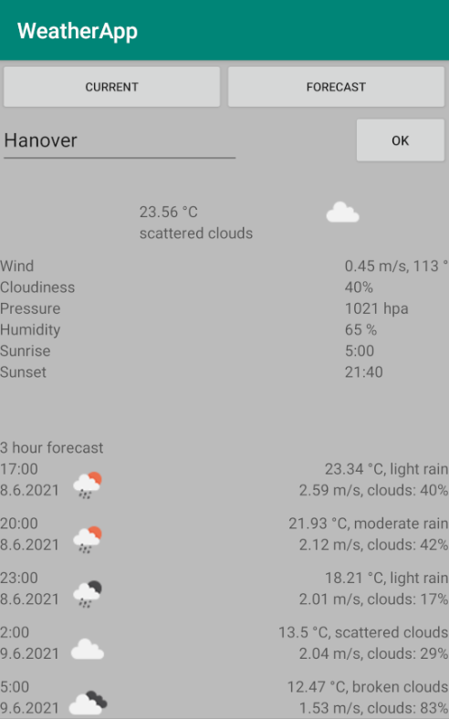

# WeatherApp

Very basic weather app for Android which can retrieve weather data using the OpenWeatherMap API.
It allows 3 hour forecasts, up to five days, from a single city



## Setup

Android Studio is used to program this app for Android. The directory named "WeatherApp" containing this app should be opened as usual from Android Studio.

The OpenWeatherMap API key must also be provided by the user. Replace "YOUR_API_KEY_HERE" with the API key from OpenWeatherMap. 

```
<?xml version="1.0" encoding="utf-8"?>
<resources>
    <string name="openweatherapi">YOUR_API_KEY_HERE</string>
</resources>
```

Save these four lines to a new file named "secrets.xml" to the directory ./app/src/main/res/values/  Otherwise the app will not work.

This file will not be commited to Git because it is already ignored by gitignore

Note that depending on what API key is used, there may be a limitation on how many requests this app can handle.

## License

This project is licensed under the terms of the BSD-2 license.
